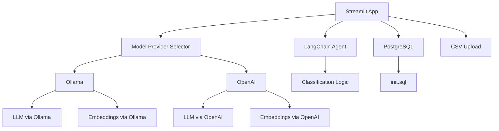

# 📰 Public Relay News Relevance Classifier

A Streamlit-based app for classifying news articles by relevance using LLMs and LangChain. Supports local and remote Ollama inference, PostgreSQL-backed ingestion, and CSV batch uploads — all containerized with Docker.

---

## 🚀 Features

- 🔍 Classify news articles using agentic LangChain workflows
- 🧠 Supports multiple model providers:
  - OpenAI
  - Ollama (local via Docker)
  - Ollama (remote via user-specified base URL)
- 📥 Upload CSVs for batch classification
- 🗃️ PostgreSQL-backed example ingestion
- 🧠 Embedding-based retrieval via ChromaDB
- 🐳 Fully containerized with Docker Compose

---

## 🧱 Architecture



---

## 🛠️ Setup

### 1. Clone the repo
```bash
git clone https://github.com/rahulsharma5693/Public-Relay-News-Classifier
cd Public-Relay-News-Classifier
```

### 2. Ensure `init.sql` is present
Make sure `app/init.sql` creates the `relevance_examples` table:
```sql
CREATE TABLE IF NOT EXISTS relevance_examples (
  analysis_id SERIAL PRIMARY KEY,
  outlet_name TEXT,
  orig_title TEXT,
  orig_body TEXT,
  relevance TEXT
);
```

### 3. Build and run
```bash
docker-compose up --build
```

### 4. Access the app
Open [http://localhost:8501](http://localhost:8501)

---

## 🌐 Remote Ollama Support

If using a remote Ollama host:
- Select **Ollama (remote)** in the app
- Enter the base URL (e.g., `http://192.168.1.50:11434`)
- Ensure the remote Ollama server is running and reachable

---

## 📦 Docker Services

| Service   | Description                          |
|-----------|--------------------------------------|
| `app`     | Streamlit frontend + LangChain logic |
| `postgres`| PostgreSQL database for examples     |
| `ollama`  | Local LLM inference engine           |

---

## 📁 File Structure

```
.
├── app/
│   ├── app.py
│   ├── ingest_to_chroma.py
│   ├── init.sql
│   └── requirements.txt
├── docker-init/
│   └── init.sql
├── Dockerfile
├── docker-compose.yml
└── README.md
```

---

## 🧪 Testing

- Upload a CSV with columns: `analysis_id`, `outlet_name`, `orig_title`, `orig_body`
- View classified results and download output
- Switch between model providers for performance comparison

---

## 📌 Notes

- Ensure Ollama models support embeddings (e.g., `nomic-embed-text`)
- PostgreSQL must be initialized with `init.sql` on first run
- Remote Ollama must be reachable via HTTP

---

## ❓ FAQ

### Q: What should I do if I switch from Ollama to OpenAI for RAG or Agentic workflows?

If you previously used **Ollama** to ingest documents into **ChromaDB**, and then switch to **OpenAI**  or vice-versa for RAG or agentic classification, please **reset the ChromaDB folder first**.

This ensures embedding formats remain consistent and avoids runtime errors due to incompatible vector encodings.

You can reset ChromaDB from the app UI using the **🧹 Reset ChromaDB** button, or manually delete the folder:
```bash
rm -rf ./chromadb
